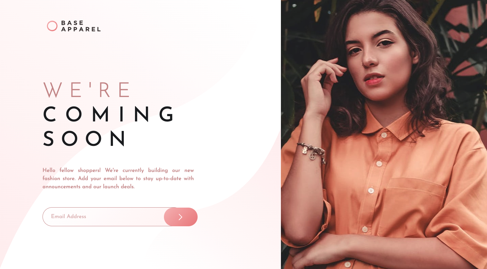
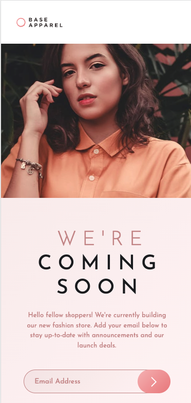

# Base Apparel coming soon page solution

### Screenshot





### Links

- Solution URL: [Solution](https://your-solution-url.com)

## My process

### Built with

- Semantic HTML5 markup
- CSS custom properties
- Bootstrap
- JQuery


### What I learned

```css
@import url('https://fonts.googleapis.com/css2?family=Josefin+Sans:wght@300;400;600&display=swap');

@media (min-width: 1019px){
  .grid {
        display:flex;
        flex-direction: row-reverse;
    }
}

.email-error{
  background-position: 82% 45%;
}

img{
  width: 100%;
  height: 100%;
  object-fit: cover; 
  object-position: 100% 20%;
}
```


